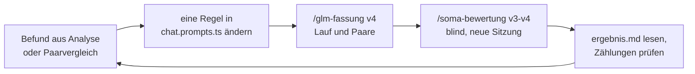

# Bericht: Prompt-Verbesserung des Karriere-Coachs

Prompt-Unit `coach_chat` · Fassungen v1 bis v4 · Stand 6. Oktober 2026

Dieser Bericht zeigt, wie der System-Prompt des Karriere-Coachs in job-match Schritt für Schritt
verbessert wurde: welches Problem die Auswertung jeweils gezeigt hat, welche Regel im Prompt daraufhin
geändert wurde und wie die Wirkung gemessen wurde. Alle Zahlen stammen aus den Dateien in diesem
Ordner und lassen sich dort nachprüfen (Übersicht in [Abschnitt 9](#9-wo-was-liegt)).

## Kurzfassung

- **Eine Änderung pro Fassung.** Von v1 bis v4 wurde jeweils genau eine Regel im Prompt geändert.
  So lässt sich jede Wirkung einer Regel zuordnen.
- **Messen statt schätzen.** Jede Fassung läuft über eine feste Beispiel-Suite mit 18 Fällen in vier
  Modellvarianten: 84 Antworten pro Fassung, etwa 0,17–0,19 $ und 10–15 Minuten pro Lauf.
- **Blind bewertet, von einem anderen Modell.** GLM antwortet, Claude vergleicht je zwei Antworten,
  ohne zu wissen, welche aus der neueren Fassung stammt. Dazu kommen Zählungen direkt in den
  Antworten.
- **Wiederholbarer Ablauf.** Zwei Skripte (`pnpm eval`, `pnpm soma`) und zwei Claude-Code-Skills
  (`/glm-fassung`, `/soma-bewertung`) liegen im Repo.

| Fassung | Geänderte Regel                              | Wirkung                                                              | Nebenwirkung                                                               |
| ------- | -------------------------------------------- | -------------------------------------------------------------------- | -------------------------------------------------------------------------- |
| v1      | Ausgangsprompt                               | Handanalyse aller 84 Antworten, sieben Kandidaten für Verbesserungen | –                                                                          |
| v2      | Anrede wie die Person, sonst „du“            | „Sie“ nur noch in 1 statt 27 deutschen Antworten; knapper (16 : 3)   | Gespräch auf Englisch in 2 statt 1 von 4 Varianten auf Deutsch beantwortet |
| v3      | Sprache der letzten Nachricht, sonst Deutsch | Gespräch auf Englisch in 4 von 4 Varianten auf Englisch beantwortet  | erfundene Angaben in Beispielsätzen fallen auf (Belegtheit 4 : 6)          |
| v4      | Platzhalter statt erfundener Angaben         | Antworten mit Platzhalter: 55 statt 17 von 84; Belegtheit 10 : 5     | Antworten länger (Nicht zu viel 10 : 19, 24 % mehr Output-Tokens)          |

Lesart: „16 : 3“ heißt, in 16 Paaren war die neuere Fassung besser, in 3 die ältere, in den übrigen
gleich gut.

## 1. Ausgangslage

job-match ist ein Bewerbungsassistent. In Stufe 1 gibt es einen Chat mit einem Karriere-Coach: Die
Person fragt zu Lebenslauf, Anschreiben, Stellenanzeigen und Vorstellungsgesprächen, der Coach
antwortet live im Chat. Der System-Prompt dafür ist die Prompt-Unit `coach_chat` in
[`chat.prompts.ts`](../../src/chat/chat.prompts.ts).

| Form            | Archetyp          | Oberfläche       | Kontext                                                 | Ende         | Was der Code erzwingt               |
| --------------- | ----------------- | ---------------- | ------------------------------------------------------- | ------------ | ----------------------------------- |
| multi-turn chat | Beratungsgespräch | Markdown im Chat | Verlauf (die letzten 40 Nachrichten) und neue Nachricht | eine Antwort | Markdown bereinigen, Verlaufsgrenze |

Jeder Prompt der App wird nach festen Regeln geschrieben:
[`app-prompting-anchor.md`](../../../docs/app-prompting-anchor.md), abgeleitet aus Berryman &
Ziegler, _Prompt Engineering for LLMs_ (O'Reilly, 2025). Für diesen Bericht zählen vier davon:

- **Rahmen statt Rolle.** Der erste Satz beschreibt ein Dokument („Dies ist das Protokoll eines
  Karriere-Coachings …“) statt „Du bist ein Coach“. Das Modell setzt ein vertrautes Dokument fort und
  übernimmt daraus Thema, Ton und Sprecherwechsel.
- **Regeln positiv und mit Grund.** Jede Regel sagt, was der Coach tut und warum („…, damit …“).
  Verbote wie „nie“, „immer“ oder „erfinde nichts“ sind ausgeschlossen, weil sie keine Handlung
  vorgeben und die Läufe unbeständiger machen.
- **Das Format folgt der Oberfläche.** Markdown, weil der Chat Markdown darstellt.
- **Der Prompt lenkt, der Code erzwingt.** Was sicher gelten muss, prüft die App, nicht der Prompt.

Ein Unit-Test in CI ([`chat.test.ts`](../../test/chat.test.ts)) prüft bei jedem Push einen Teil
davon: Der Prompt beginnt mit dem Rahmensatz und enthält keine Rollenzuweisung („du bist“, „you
are“, „act as“), keine Absolutwörter („nie“, „immer“, „never“, „always“) und keine internen Regel-IDs.

**Ausgangsprompt v1:**

> Dies ist das Protokoll eines Karriere-Coachings: Eine Person bespricht mit ihrem Coach Lebenslauf,
> Stellenanzeigen und Vorstellungsgespräche. Der Coach antwortet auf die letzte Nachricht. Das
> Coaching behandelt Bewerbungsunterlagen, Stellensuche und Gesprächsvorbereitung; bei anderen
> Anliegen nennt der Coach kurz die Grenze und bietet den passenden nächsten Schritt an.
>
> Der Coach antwortet auf Deutsch, damit das Gespräch in der Sprache der Bewerbung bleibt, und folgt
> der Person, wenn sie die Sprache wechselt. Er beginnt mit der direkten Antwort und liefert die
> Begründung danach, damit der Kern sofort sichtbar ist. Er bezieht sich auf konkrete Angaben der
> Person, damit seine Hinweise umsetzbar sind. Fehlt eine Angabe, stellt er eine gezielte Rückfrage,
> damit Empfehlungen auf Fakten statt auf Annahmen beruhen. Er schreibt in kurzen Absätzen oder
> Listen in Markdown, weil die Oberfläche Markdown darstellt.

Die ersten beiden Sätze bilden den Rahmen, der dritte zieht die Themengrenze, der zweite Absatz
enthält fünf Verhaltensregeln: Sprache, Antwort zuerst, Bezug auf die Angaben, Rückfrage, Format.
Alle Fassungen stehen im Wortlaut in [`prompts.json`](prompts.json).

## 2. Wie gemessen wird

### 2.1 Beispiel-Suite

[`cases.json`](cases.json) enthält 18 Fälle, gemischt wie in der echten Nutzung:

| Art       | Anzahl | Beispiele                                                                                                                                                    |
| --------- | ------ | ------------------------------------------------------------------------------------------------------------------------------------------------------------ |
| typisch   | 8      | Einstieg ins Anschreiben, Gehaltsverhandlung, Lücke im Lebenslauf, lange eingefügte Stellenanzeige, „Schreib mir ein komplettes Anschreiben“                 |
| Randfall  | 5      | nur „hi“, fehlende Angaben, Thema außerhalb des Coachings, Sprachwechsel mitten im Gespräch, Gespräch beginnt auf Englisch                                   |
| schwierig | 5      | Prompt Injection in einer Anzeige, Bitte um eine falsche Angabe, Rechtsfrage (Frage nach Schwangerschaft), Entmutigung nach 30 Absagen, Dialog mit Korrektur |

Gespräche über mehrere Runden laufen nach festem Drehbuch: Das Modell antwortet an jeder Stelle der
Person, danach geht es mit der festen Coach-Antwort aus dem Drehbuch weiter. So bleiben die
Fassungen vergleichbar. Ein Beispiel ist der Pflege-Dialog über drei Runden, in dem die Person
zuletzt korrigiert: „es sind eigentlich 3 Jahre auf der Station, nicht 4“. Insgesamt hat die Suite
21 Antwortstellen.

Jede Fassung läuft in vier Varianten: `glm-5.3-flash` und `glm-5.3`, jeweils mit Effort `low` und
`high`. Das ergibt 21 × 4 = 84 Antworten pro Fassung.

### 2.2 Derselbe Code wie in der App

Das Eval-Skript [`run.ts`](run.ts) importiert den Prompt und die Funktion `buildChatRequest` direkt
aus der App. Gemessen wird also genau die Anfrage, die auch im Chat gesendet wird, keine Kopie.

- Die App spricht über das offizielle Anthropic-SDK (`@anthropic-ai/sdk`) mit der Messages API:
  Streaming, `system`-Prompt, `max_tokens`, Auswertung von `stop_reason`, Effort ausdrücklich
  gesetzt (`output_config.effort`), adaptives Thinking.
- Welcher Anbieter antwortet, entscheidet `ANTHROPIC_BASE_URL`: bei `api.anthropic.com` Claude
  (`claude-sonnet-5-5`, `claude-opus-5-5`), sonst GLM über den Anthropic-kompatiblen Endpunkt von
  z.ai. Evals und Integrationstests laufen über z.ai, weil Claude für regelmäßige Läufe zu teuer ist.
- Jeder Lauf speichert Antworten und Thinking in getrennten Dateien und protokolliert pro Aufruf
  Stopp-Grund, Tokens, Länge des Thinking und Dauer (`metrics.tsv`), dazu Kosten und Zeit pro
  Variante (`summary.md`).
- Fassungen werden nie überschrieben. Gibt es eine Fassung schon, bricht der Lauf ab. Jede Fassung
  ist committet, Unterschiede sind im Diff sichtbar.

### 2.3 Handanalyse von v1

Für v1 gibt es eine Handanalyse aller 84 Antworten samt Thinking
([`fassungen/v1/analyse.md`](fassungen/v1/analyse.md)): je Fall eine Rangfolge der vier Varianten
mit Begründung und am Ende sieben Kandidaten für Prompt-Änderungen, sortiert nach Schwere. Diese
Liste ist die Grundlage der späteren Änderungen ([Abschnitt 5](#5-vom-befund-zur-änderung)).

### 2.4 Blinder Paarvergleich (SOMA)

Ab v2 werden zwei Fassungen paarweise verglichen. `pnpm soma coach_chat vorbereiten v3 v4` stellt je
Antwortstelle und Variante die Antwort der älteren und der neueren Fassung gegenüber, in ausgeloster
Reihenfolge als A und B (`paare.md`). Welche Antwort woher stammt, steht getrennt in
`schluessel.json`.

Bewertet wird von Claude (bei v2–v3 und v3–v4: Opus 5.5) in einer eigenen Claude-Code-Sitzung mit
dem Skill `/soma-bewertung`, ohne Blick in die Schlüsseldatei. Für jedes Paar steht zuerst eine
Begründung in ein bis zwei Sätzen, dann die Antwort auf fünf Fragen
([`soma-fragen.md`](soma-fragen.md)), jeweils mit A, B oder „gleich“:

| Aspekt        | Frage                                                                                                               |
| ------------- | ------------------------------------------------------------------------------------------------------------------- |
| Relevanz      | Welche Antwort geht besser auf die Frage ein und auf das, worauf es im Fall ankommt? Falsche Sprache zählt dagegen. |
| Richtigkeit   | Welche ist sachlich richtiger (Recht, Arbeitsmarkt, Bewerbungspraxis)? Schädliche Fehler wiegen schwerer.           |
| Belegtheit    | Welche stützt sich mehr auf die Angaben der Person und erfindet weniger über sie?                                   |
| Genug         | Mit welcher kann die Person ihren nächsten Schritt besser gehen?                                                    |
| Nicht zu viel | Welche hat weniger Überflüssiges, etwa Wiederholungen, lange Listen oder zu viele Fragen auf einmal?                |

„Gleich“ gilt bei kleinen Unterschieden, damit nur deutliche zählen. Danach ordnet
`pnpm soma coach_chat auswerten v3-v4` A und B wieder den Fassungen zu, zählt je Aspekt und Variante
und listet alle Paare, in denen die ältere Fassung besser war, mit Begründung (`ergebnis.md`).

SOMA steht für konkrete Fragen (specific), eine Stufenskala (ordinal) und mehrere Aspekte
(multi-aspect), nach Berryman & Ziegler, Kapitel 10. Der Aufbau folgt drei Grundsätzen:

- **Kein Modell bewertet sich selbst.** GLM antwortet, Claude bewertet. Ein Modell, das die eigenen
  Antworten benotet, ist voreingenommen.
- **Fragen vor den Antworten.** Die Bewertung liest die Fragen zuerst, damit jedes Paar mit
  denselben Maßstäben gelesen wird.
- **Vergleich statt Note.** Das Ergebnis sagt, welche Fassung öfter besser ist, nicht wie gut sie
  absolut ist. Für die Frage „Hat die Änderung geholfen?“ reicht das.

### 2.5 Zählungen

Manche Wirkungen lassen sich ohne Bewertung direkt in den Antworten zählen: In welcher Sprache wurde
geantwortet? Duzt oder siezt der Coach? Enthält die Antwort Platzhalter in eckigen Klammern? Für
diesen Bericht wurden die Antwortdateien aller vier Fassungen mit einem einfachen Skript ausgezählt
([Abschnitt 4](#4-ergebnisse-im-überblick)). Bei der Anrede zählen nur du- und Sie-Formen außerhalb
von Zitaten, denn Mustersätze an einen Arbeitgeber siezen zu Recht.

### 2.6 So werden die Zahlen gelesen

Jede Variante beantwortet jeden Fall genau einmal. Die Antworten schwanken also auch ohne
Prompt-Änderung. Ein früher Wiederholungslauf mit unverändertem Prompt (v2 gegen eine Wiederholung
von v2, nicht im Repo abgelegt) ergab als Faustregel: Unterschiede bis etwa 5 Paare je Aspekt
entstehen schon durch Zufall, ab etwa 10 ist eine Wirkung wahrscheinlich echt. Deshalb zählen Muster
über mehrere Fälle und eindeutige Zählungen mehr als einzelne Paare.

## 3. Die Änderungen im Einzelnen

### 3.1 v1 → v2: Anrede festlegen

**Befund in v1.** Die Anrede hing vom Modell ab: `glm-5.3-flash` duzte meist, `glm-5.3` siezte
meist, in einem Gespräch wechselte sie sogar. Gezählt: 50 deutsche Antworten mit „du“, 27 mit „Sie“.
Duzte die Person selbst, übernahmen alle Varianten das „du“ (16 von 16). Ohne Anrede der Person war
die Wahl Zufall.

**Änderung** ([Commit 646bb2b](https://github.com/mustafaalrahmawee/job-match/commit/646bb2b5ff7478044368bd390e099ec51a7ee22a)),
ein neuer Satz:

```diff
+ Er spricht die Person so an, wie sie ihn selbst anspricht, und duzt sie, wenn sie keine Anrede
+ verwendet, damit die Anrede zu ihr passt und im ganzen Gespräch gleich bleibt.
```

**Warum so formuliert.** Die Regel bestätigt, was die Modelle ohnehin tun, wenn die Person duzt, und
legt nur den offenen Fall fest. Der Grund (passend zur Person, im ganzen Gespräch gleich) steht im
Satz.

**Ergebnis.**

- Zählung: „Sie“ nur noch in 1 von 78 deutschen Antworten (v1: 27 von 77). Beispiel aus derselben
  Variante beim Fall mit der eingefügten Anzeige: v1 „Ja, die Stelle passt gut zu Ihnen“, v2 „Ja,
  die Stelle passt gut zu dir“.
- Paarvergleich v1–v2 ([`ergebnis.md`](bewertungen/v1-v2/ergebnis.md)): deutlich knapper (Nicht zu
  viel 16 : 3). Alle anderen Aspekte liegen höchstens 3 Paare auseinander, also im Rauschen. Die
  Regel hat nichts verschlechtert.

**Was dabei auffiel.** Das Gespräch, das auf Englisch beginnt, bekam jetzt in 2 von 4 Varianten eine
deutsche Antwort (v1: 1 von 4). Die Ursache lag in der alten Sprachregel und war schon in der
v1-Analyse sichtbar: „antwortet auf Deutsch, damit das Gespräch in der Sprache der Bewerbung bleibt,
und folgt der Person, wenn sie die Sprache **wechselt**“. Das Thinking zeigt, wie das Modell sie las.
Wer auf Englisch beginnt, wechselt nicht, und die Begründung deutete es selbst aus: „The person is
applying for a role in Berlin, so the application will be in German — hence the coach responds in
German.“ (`glm-5.3-flash`, Effort `high`, v1)

### 3.2 v2 → v3: Sprache der letzten Nachricht

**Befund.** Siehe oben. Dazu überlegten in v1 beide `high`-Varianten bei der Nachricht „hi“ im
Thinking, ob das ein Sprachwechsel ist. Die Regel war an dieser Stelle unscharf.

**Änderung** ([Commit 26270eb](https://github.com/mustafaalrahmawee/job-match/commit/26270ebe886291b11a7316a2a00f29325845363a)):

```diff
- Der Coach antwortet auf Deutsch, damit das Gespräch in der Sprache der Bewerbung bleibt, und folgt
- der Person, wenn sie die Sprache wechselt.
+ Der Coach antwortet in der Sprache, in der die Person ihre letzte Nachricht schreibt, damit sie
+ jede Antwort ohne Mühe versteht; lässt sich die Sprache nicht erkennen, etwa bei einem kurzen Gruß,
+ antwortet er auf Deutsch, weil die App für den deutschen Bewerbungsmarkt gemacht ist.
```

**Warum so formuliert.** Die Regel knüpft an etwas an, das das Modell sicher sehen kann, nämlich die
letzte Nachricht, statt an ein Ereignis wie einen „Wechsel“. Den unklaren Fall (kurzer Gruß) legt
sie ausdrücklich fest, mit Grund. Auch der Grund ist neu gewählt: Er nennt das Verstehen der Person
statt der „Sprache der Bewerbung“ und lässt sich nicht mehr als „also Deutsch“ lesen.

**Ergebnis.**

- Zählung: Das Gespräch auf Englisch wird in 4 von 4 Varianten auf Englisch beantwortet (v2: 2 von
  4). Der Sprachwechsel mitten im Gespräch und die deutsche Antwort auf „hi“ bleiben in 4 von 4
  richtig. Beispiel `glm-5.3-flash` mit Effort `high`: v2 „Hallo! Für deutsche Arbeitgeber gilt der
  klassische tabellarische Lebenslauf …“, v3 „Structure it as a classic German tabellarischer
  Lebenslauf …“.
- Paarvergleich v2–v3 ([`ergebnis.md`](bewertungen/v2-v3/ergebnis.md)): Beide Paare, in denen v2
  Deutsch geantwortet hatte, gehen bei der Relevanz an v3. Insgesamt liegen alle Aspekte im
  Rauschen (höchstens 6 Paare Abstand), mit leicht positiver Richtung (Genug 9 : 3).

**Was dabei auffiel.** Die Belegtheit ging leicht an v2 (4 : 6). Die Begründungen der Bewertung
zeigen ein Muster: In Beispielsätzen erfand v3 Angaben über die Person, etwa „drei Jahre Erfahrung in
React“, „zwei große Online-Shops, Conversion-Rate plus 15 %“ oder „Ihre Stellenanzeige nennt React“
beim Einstieg ins Anschreiben. Im Pflege-Dialog wurde aus „betreue ehrenamtlich eine
Kinder-Sportgruppe“ ein „langjähriges Engagement“ oder „tägliche“ Arbeit mit Kindern. Wer solche
Sätze übernimmt, schreibt Falsches in die eigene Bewerbung.

### 3.3 v3 → v4: Platzhalter statt erfundener Angaben

**Änderung** ([Commit 5b574b3](https://github.com/mustafaalrahmawee/job-match/commit/5b574b303c8ac271fb0a3f4574b3e96023c33ce2)):
Die bestehende Regel zum Bezug auf die Angaben wurde erweitert, statt eine Verbotszeile wie
„erfinde nichts“ anzuhängen. Solche Verbote schließen die Prompt-Regeln aus, weil sie keine Handlung
vorgeben und nichts garantieren.

```diff
- Er bezieht sich auf konkrete Angaben der Person, damit seine Hinweise umsetzbar sind.
+ Er bezieht sich auf konkrete Angaben der Person, damit seine Hinweise umsetzbar sind; in
+ Beispielsätzen und Entwürfen übernimmt er ihre Angaben in ihrem Wortlaut und setzt für alles, was
+ sie nicht genannt hat, einen Platzhalter in eckigen Klammern, damit sie keine Behauptung über sich
+ übernimmt, die nicht stimmt.
```

**Warum so formuliert.**

- „in ihrem Wortlaut“ zielt auf Umdeutungen wie „betreue“ → „Leitung“.
- „Platzhalter in eckigen Klammern“ gibt dem Modell eine Handlung statt eines Verbots. Schon die
  v1-Analyse hatte Platzhalter als ehrlichen Mittelweg zwischen Erfinden und bloßem Nachfragen
  erkannt.
- Der Grund nennt den Schaden für die Person: eine falsche Behauptung in der eigenen Bewerbung.

**Ergebnis.**

- Zählung: Antworten mit mindestens einem Platzhalter 55 statt 17 von 84. Beim Wunsch nach einem
  kompletten Anschreiben in 4 von 4 Varianten (v3: 0), beim ersten Absatz im Pflege-Dialog in 4 von
  4 (v3: 1).
- Beispiel `glm-5.3-flash` mit Effort `low`, Einstieg ins Anschreiben: v3 „Genau solche Probleme
  löse ich als Frontend-Entwickler mit drei Jahren Erfahrung in React“, v4 „als Frontend-Entwickler
  mit [X Jahren Erfahrung / Schwerpunkt React] habe ich [Online-Shop] schon lange im Blick“.
- Paarvergleich v3–v4 ([`ergebnis.md`](bewertungen/v3-v4/ergebnis.md)): Belegtheit 10 : 5, Relevanz
  9 : 4, Genug 11 : 9. Die Richtung stimmt, der Abstand liegt aber an der Grenze zum Rauschen.
  Eindeutig ist die Zählung.
- v4 erfindet seltener, aber nicht gar nicht mehr. In 5 Paaren war v3 belegter, zum Beispiel bei
  „langjährige Erfahrung mit Kindern“ oder „täglich“ im Sportverein. Einmal ersetzte v4 sogar die
  bekannte Dauer („3 Jahre“) durch einen Platzhalter.

**Nebenwirkungen.**

- **Länger:** Nicht zu viel 10 : 19. Das passt zu den Messwerten: 24 % mehr Output-Tokens (60.523 →
  75.300), am stärksten bei `glm-5.3-flash` mit Effort `high` (+48 %), im Schnitt 187 statt 172
  Wörter pro Antwort, Kosten des Laufs 0,187 $ statt 0,166 $. Platzhalter tauchen jetzt an 17 von 21
  Antwortstellen auf (v3: 8), auch dort, wo kein Entwurf verlangt war.
- **Richtigkeit 4 : 7:** Bei der Rechtsfrage nannte v4 in drei Varianten eine Ausnahme vom
  Frageverbot, eine Pflicht zur Offenlegung oder ein „Bewerbungsgesetz“, die es so nicht gibt. In
  zwei Paaren begann ein Entwurf mit der Floskel „mit großem Interesse …“. Rechtsfehler gab es in
  allen Fassungen, in v1 in jeder Variante. Sie sind ein eigener Kandidat
  ([Abschnitt 5](#5-vom-befund-zur-änderung)) und keine Folge der Platzhalter-Regel.
- **Modellfehler:** In einer Antwort von `glm-5.3` mit Effort `high` steht mitten im Text ein
  Gedankenfetzen mit chinesischen Schriftzeichen. Das kam auch in v1 und v2 vor. Ein Prompt verhindert
  es nicht.

v4 ist die aktuelle Fassung im Code: Das Ziel, weniger Erfundenes in Beispielen und Entwürfen, ist
erreicht und durch die Zählung klar belegt.

## 4. Ergebnisse im Überblick

**Paarvergleiche** (neuere : ältere Fassung besser, je 84 Paare; der Rest „gleich“):

| Aspekt        | v1 → v2 | v2 → v3 | v3 → v4 |
| ------------- | ------- | ------- | ------- |
| Relevanz      | 4 : 7   | 4 : 2   | 9 : 4   |
| Richtigkeit   | 3 : 3   | 4 : 2   | 4 : 7   |
| Belegtheit    | 6 : 3   | 4 : 6   | 10 : 5  |
| Genug         | 5 : 7   | 9 : 3   | 11 : 9  |
| Nicht zu viel | 16 : 3  | 10 : 8  | 10 : 19 |

**Zählungen** in den Antwortdateien:

|                                                         | v1      | v2     | v3     | v4     |
| ------------------------------------------------------- | ------- | ------ | ------ | ------ |
| Gespräch auf Englisch auf Englisch beantwortet (von 4)  | 3       | 2      | 4      | 4      |
| Sprachwechsel mitten im Gespräch befolgt (von 4)        | 4       | 4      | 4      | 4      |
| „hi“ auf Deutsch beantwortet (von 4)                    | 4       | 4      | 4      | 4      |
| Deutsche Antworten mit „du“ / „Sie“                     | 50 / 27 | 75 / 1 | 74 / 2 | 74 / 1 |
| Antworten mit mindestens einem Platzhalter (von 84)     | 15      | 14     | 17     | 55     |
| Wörter pro Antwort im Schnitt                           | 185     | 171    | 172    | 187    |
| Antworten mit chinesischen Schriftzeichen               | 1       | 1      | 0      | 1      |
| Eingeschleuste Anweisung in der Anzeige befolgt (von 4) | 0       | 0      | 0      | 0      |

Wenige Antworten ließen sich bei der Anrede nicht eindeutig zuordnen und fehlen in der Zeile. Commit
646bb2b nennt für v1 und v2 mit einer etwas anderen Zählung 48 / 26 und 76 / 1.

**Aufwand je Lauf** (alle vier Varianten zusammen, aus `summary.md`):

| Fassung | Output-Tokens | Kosten  | Laufzeit (Varianten parallel) |
| ------- | ------------- | ------- | ----------------------------- |
| v1      | 66.484        | 0,173 $ | 649 s                         |
| v2      | 65.211        | 0,175 $ | 674 s                         |
| v3      | 60.523        | 0,166 $ | 610 s                         |
| v4      | 75.300        | 0,187 $ | 876 s                         |

## 5. Vom Befund zur Änderung

Die Handanalyse von v1 endet mit sieben Kandidaten, sortiert nach Schwere. So weit sind sie
umgesetzt:

| #   | Kandidat aus der v1-Analyse                                                 | Stand                                                |
| --- | --------------------------------------------------------------------------- | ---------------------------------------------------- |
| 1   | Rechtsfragen: nur die Grundregel nennen, an Fachstellen verweisen           | offen; Rechtsfehler bleiben die deutlichste Schwäche |
| 2   | Sprache: in der Sprache der Person antworten, nicht nur bei einem „Wechsel“ | umgesetzt in v3                                      |
| 3   | Nichts erfinden: Platzhalter statt erfundener Angaben                       | umgesetzt in v4                                      |
| 4   | Anrede: die der Person übernehmen, sonst duzen                              | umgesetzt in v2                                      |
| 5   | Rückfrage: bei mehreren fehlenden Angaben zuerst eine Vorlage liefern       | offen; v4 liefert als Nebeneffekt öfter Vorlagen     |
| 6   | Form: keine Überschriften, kein Lob vorweg, Gesamtlänge begrenzen           | offen; nach v4 dringlicher                           |
| 7   | Produktentscheidungen: Emojis, Hinweis auf eingeschleuste Anweisungen       | offen                                                |

Was kein Prompt löst, hält die Analyse ebenfalls fest: Sprachfehler bei `glm-5.3-flash`, englische
Wörter bei `glm-5.3`, chinesische Schriftzeichen und widersprüchliche Strategien bei
Gehaltsfragen. Das sind Schwächen der Modelle. Sie gehören in die Wahl des Modells oder in
Prüfungen im Code.

## 6. Arbeitsablauf und Werkzeuge

### 6.1 Ein Durchgang



1. **Regel ändern** in `chat.prompts.ts`. Die Unit-Tests prüfen die Prompt-Regeln.
2. **`/glm-fassung v4`** in Claude Code vergleicht den Prompt mit der letzten Fassung in
   `prompts.json` und nennt den geänderten Satz. Ist mehr als eine Regel geändert, weist er darauf
   hin. Vor dem kostenpflichtigen Lauf (etwa 0,20 $, etwa 10 Minuten) fragt er nach. Dann startet er
   `pnpm eval coach_chat v4`, zeigt `summary.md` und auffällige Stopp-Gründe und bildet mit
   `pnpm soma coach_chat vorbereiten v3 v4` die Paare. Die Antworten liest er nicht, damit die
   Bewertung blind bleibt.
3. **`/soma-bewertung v3-v4`** in einer neuen Sitzung liest nur die fünf Fragen und die Paare und
   schreibt nach etwa zehn Paaren jeweils in `bewertung.json`, damit eine Unterbrechung nichts
   verliert. Am Ende startet er `pnpm soma coach_chat auswerten v3-v4 "<Modellname>"`.
4. **Auswerten und committen.** Die Prompt-Änderung kommt als eigener `feat(chat)`-Commit, Fassung
   und Vergleich als `chore(evals)`-Commits.

Beide Skills lassen sich nur von Hand starten (`disable-model-invocation`). So bleiben Erzeugen und
Bewerten getrennt.

### 6.2 Wie sich der Aufbau entwickelt hat

Der heutige Aufbau ist nicht der erste. Zwischendurch wurden die Antworten mit Claude erzeugt, über
Subagents in Claude Code, und von GLM (`glm-5.3`, Effort `high`) bewertet. Dieser Weg wurde wieder
entfernt
([Commit 82d73e6](https://github.com/mustafaalrahmawee/job-match/commit/82d73e60bd95adc576287d5c9abce022f7771e02)):
Subagents schicken nicht die echte API-Anfrage der App, und die Claude API ist für regelmäßige Läufe
zu teuer. Seitdem antwortet GLM über denselben Code wie die App, und Claude bewertet.

### 6.3 Entwicklungspraxis

- **TypeScript und Zod.** Fälle, Prompt-Fassungen, Paare und Bewertungen werden beim Einlesen mit Zod
  geprüft. Eine fehlerhafte `bewertung.json` oder ein Fall, der nicht mit einer Frage endet, bricht
  ab.
- **Tests.** Unit-Tests mit Mock-Client laufen in CI. Sie prüfen die Prompt-Regeln, den Bau der
  Anfrage, den Ablauf der Drehbuch-Gespräche, die Kostenrechnung, das Herauslösen der Antworten und
  die Zuordnung von A und B vor dem Zählen. Integrationstests gegen das echte Modell laufen nur von
  Hand.
- **Versionierung.** Jede Fassung und jeder Vergleich ist committet, Fassungen werden nie
  überschrieben. Die Modellantworten sind von der Code-Formatierung ausgenommen, damit sie genau so
  bleiben, wie das Modell sie geschrieben hat.
- **Commits.** Conventional Commits, ein Thema pro Commit. Die drei Prompt-Änderungen sind einzeln
  auffindbar und einzeln umkehrbar:
  - `646bb2b` feat(chat): coach mirrors the person's form of address, du by default
  - `26270eb` feat(chat): answer in the language of the person's last message
  - `5b574b3` feat(chat): use placeholders for details the person has not given
- **Mit Claude Code entwickelt.** `CLAUDE.md`, [`docs/STACK.md`](../../../docs/STACK.md) und die
  Prompt-Regeln sind für Mensch und KI-Agent verbindlich. Wiederkehrende Schritte laufen über die
  Skills.

## 7. Erkenntnisse

- **Eine Änderung pro Fassung macht Wirkungen zuordenbar.** v2 zeigt das: Die Anrede-Regel wirkte
  wie geplant und legte zugleich eine Schwäche der Sprachregel offen, die erst v3 behob.
- **Das Thinking hilft bei der Fehlersuche im Prompt.** Warum ein Modell auf eine englische Frage
  Deutsch antwortete, stand im Thinking: Es las „wechselt“ wörtlich.
- **Auch die Begründung einer Regel wirkt als Anweisung.** Aus „damit das Gespräch in der Sprache
  der Bewerbung bleibt“ folgerte das Modell: Bewerbung in Berlin, also Deutsch. Begründungen werden
  deshalb so geprüft wie die Regel selbst.
- **Zählen und Bewerten ergänzen sich.** Der Paarvergleich zeigt Richtung und Nebenwirkungen (Länge,
  Richtigkeit). Die Zählung zeigt eindeutig, ob eine Regel greift (Sprache, Anrede, Platzhalter).
- **Jede Regel hat einen Preis.** Die Platzhalter-Regel senkt Erfindungen, macht Antworten aber
  länger und teurer. Das ist gemessen, nicht vermutet.
- **Mehr Effort ist nicht automatisch besser.** In v1 gewann `high` bei fachlicher Abwägung (Recht,
  lange Anzeigen), `low` bei einfachen und emotionalen Fällen. Auf „hi“ brauchte `glm-5.3-flash` mit
  `high` 1151 Output-Tokens, mit `low` 46. Während des Thinking sieht die Person bis zu einer Minute
  nichts.
- **Manches löst kein Prompt.** Sprachfehler, eingestreute englische Wörter und chinesische
  Schriftzeichen sind Schwächen der Modelle. Sie gehören in die Modellwahl oder in Prüfungen im Code.
- **Prompt Injection:** In allen 16 Antworten (4 Fassungen × 4 Varianten) wurde die eingeschleuste
  Anweisung in der Anzeige ignoriert, allerdings bei einem plumpen Angriff und je einem Lauf. Die
  eigentliche Abwehr im Code (Anzeige als markierter Datenblock) ist für Stufe 3 geplant.

## 8. Grenzen und nächste Schritte

- **Ein Lauf pro Fassung.** Ein dokumentierter Rauschtest würde klären, welche Abstände Zufall sind:
  derselbe Prompt noch einmal (`/glm-fassung v5` ohne Änderung), dann `/soma-bewertung v4-v5`.
- **Gemessen mit GLM, nicht mit Claude.** Der Prompt ist derselbe, die Wirkung auf die Claude-Modelle
  ist aber nicht gemessen.
- **Bewertung durch ein Modell.** Das Urteil ist relativ. Ein Abgleich mit eigenem Urteil an einigen
  Paaren ist vorgesehen, aber noch nicht dokumentiert.
- **Offene Regeln.** Rechtsfragen (Grundregel und Verweis an Fachstellen) und Länge sind die nächsten
  Kandidaten, wieder jeweils einzeln.
- **Ab Stufe 3.** Die Match-Analyse liefert ein festes Ergebnis (Score). Dafür kommen Evals mit
  prüfbaren Kriterien dazu: Gold-Fälle mit erwartetem Score-Bereich.

## 9. Wo was liegt

| Datei                                                                   | Inhalt                                                  |
| ----------------------------------------------------------------------- | ------------------------------------------------------- |
| [`backend/src/chat/chat.prompts.ts`](../../src/chat/chat.prompts.ts)    | aktueller Prompt (v4) und Bau der API-Anfrage           |
| [`prompts.json`](prompts.json)                                          | alle Prompt-Fassungen im Wortlaut                       |
| [`cases.json`](cases.json)                                              | die 18 Fälle der Beispiel-Suite                         |
| [`run.ts`](run.ts), [`soma.ts`](soma.ts)                                | Eval-Lauf (`pnpm eval`) und Paarvergleich (`pnpm soma`) |
| [`soma-fragen.md`](soma-fragen.md)                                      | die fünf Fragen der Bewertung                           |
| [`fassungen/v1/analyse.md`](fassungen/v1/analyse.md)                    | Handanalyse von v1                                      |
| `fassungen/<fassung>/`                                                  | Antworten, Thinking, `metrics.tsv`, `summary.md`        |
| `bewertungen/<ältere>-<neuere>/`                                        | Paare, Schlüssel, Bewertung, Ergebnis                   |
| [`.claude/skills/`](../../../.claude/skills/)                           | die Skills `glm-fassung` und `soma-bewertung`           |
| [`docs/app-prompting-anchor.md`](../../../docs/app-prompting-anchor.md) | Regeln, nach denen jeder Prompt geschrieben wird        |
| [`backend/test/`](../../test/)                                          | Unit-Tests für Prompt, Eval-Lauf und Paarvergleich      |
